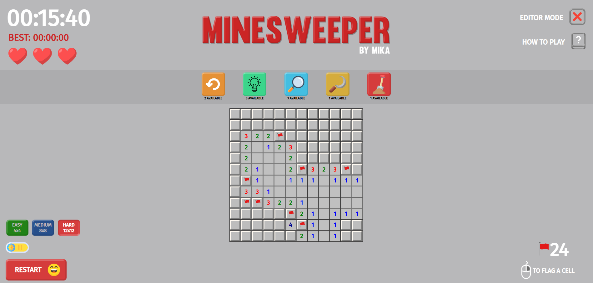

<!DOCTYPE html>
<html lang="en">
<head>
  <meta charset="UTF-8">
  <meta name="viewport" content="width=device-width, initial-scale=1.0">
  <title>Minesweeper – Super Version</title>
</head>
<body>

<h1>Minesweeper – Super Version 🧨</h1>

This is my <strong>first full-stack bootcamp project</strong>, built using <strong>vanilla JavaScript, HTML, and CSS</strong>. 
It's a fully-featured Minesweeper game with many extra functionalities beyond the classic version.

The goal of the game is to reveal all safe cells without hitting a mine. Clicking a mine can reduce your lives or end the game, depending on your remaining lives.

<h2>Live Demo 🚀</h2>

You can try the game <a target="_blank" href="https://mikaridley.github.io/Mine-Sweeper/">here</a>

<h2>Preview 📸</h2>

<h2>Features ✨</h2>

<h3>Core Gameplay</h3>
<ul>
  <li>Classic Minesweeper logic</li>
  <li>Left-click to reveal a cell</li>
  <li>Right-click to flag/unflag a suspected mine</li>
  <li>Game ends when all mines are flagged and all other cells are revealed (Victory) or when no lives remain (Game Over)</li>
  <li>First click is never a mine</li>
</ul>

<h3>Levels</h3>
<ul>
  <li>Beginner: 4×4 board with 2 mines</li>
  <li>Medium: 8×8 board with 14 mines</li>
  <li>Expert: 12×12 board with 32 mines</li>
</ul>

<h3>Extra Features</h3>
<ul>
  <li><strong>Lives:</strong> Player has 3 lives; clicking a mine loses a life but allows continuation</li>
  <li><strong>Hints:</strong> 3 hints per game – reveal a cell and its neighbors temporarily</li>
  <li><strong>Safe-Click:</strong> 3 safe-clicks per game – reveals a random safe cell temporarily</li>
  <li><strong>Dark Mode toggle</strong> for better visual experience</li>
  <li><strong>Undo button</strong> – revert some previous moves</li>
  <li><strong>Mega Hint:</strong> Reveal a rectangular area of the board temporarily</li>
  <li><strong>Mine Exterminator:</strong> Remove 3 random mines and recalculate neighbor counts</li>
  <li><strong>Manual Mine Placement:</strong> Play a mode where the player first sets the mines</li>
  <li><strong>Best Score Tracking:</strong> Stored per level in local storage</li>
</ul>

<h3>Technical Highlights</h3>
<ul>
  <li>Game board implemented as a <strong>matrix of objects</strong>:
    <pre><code>{
    minesAroundCount: 0,
    isRevealed: false,
    isMine: false,
    isMarked: false
}</code></pre>
  </li>
  <li>Dynamic mine placement after the first click</li>
  <li>Recursive reveal of neighboring safe cells</li>
  <li>Full <strong>DOM manipulation</strong> using vanilla JavaScript</li>
  <li>Responsive design for desktop and mobile</li>
</ul>

<h2>How to Play 🎮</h2>
<ol>
  <li>Open <code>index.html</code> in your browser.</li>
  <li>Click a cell to reveal it.</li>
  <li>Right-click to flag/unflag suspected mines.</li>
  <li>Use hints, safe-clicks, and mega-hints strategically.</li>
  <li>Try to reveal all safe cells without losing all lives.</li>
  <li>Press the smiley button to restart at any time.</li>
  <li>Toggle dark mode for comfort during play.</li>
</ol>

<h2>Technologies Used 🛠️</h2>
<ul>
  <li>HTML</li>
  <li>CSS</li>
  <li>JavaScript (Vanilla)</li>
  <li>DOM Manipulation</li>
</ul>

<h2>Extra Notes 💡</h2>
<ul>
  <li>This project helped me practice <strong>JavaScript logic</strong>, <strong>DOM manipulation</strong>, and <strong>event handling</strong>.</li>
  <li>It’s fully functional without any external libraries or frameworks.</li>
</ul>

Made with ❤️ by <strong>Mika Ridley</strong>

</body>
</html>
